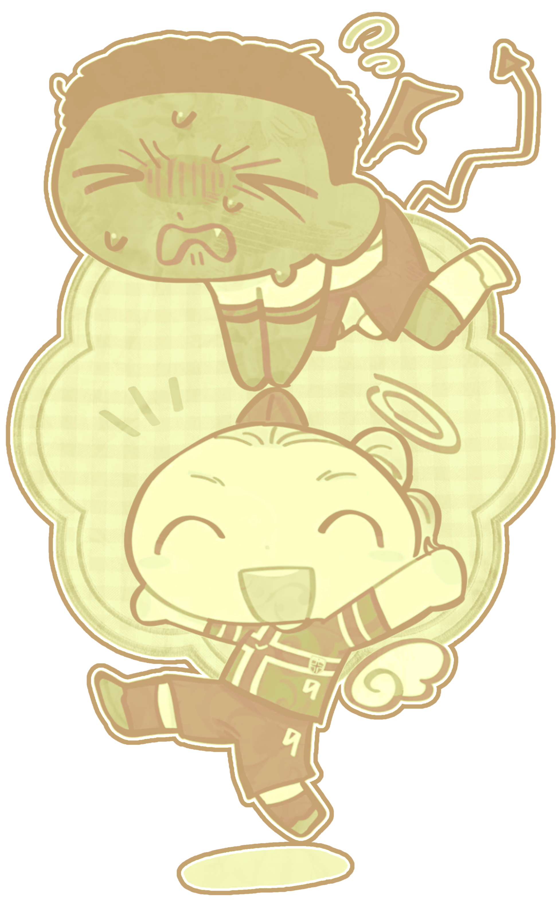
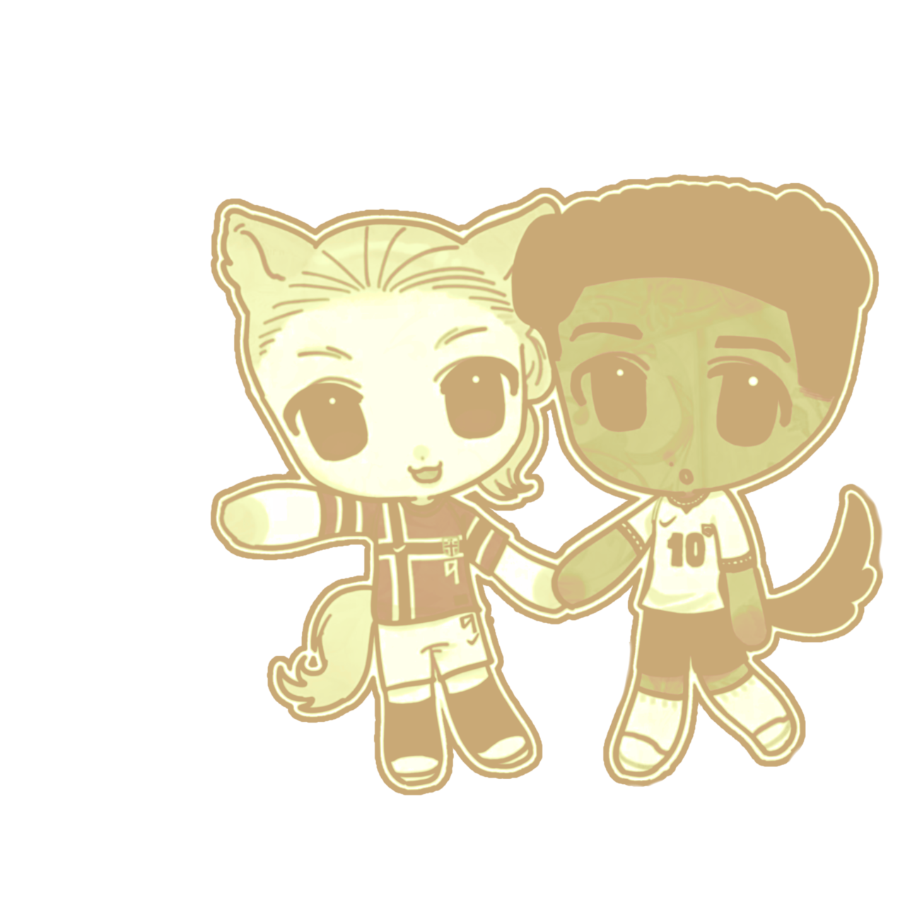

 
 
  

 
 
 
  
   
   
  
${\textsf{\color{#ceab7f}"𝘢𝘯𝘥 𝘫𝘶𝘴𝘵 𝘯𝘰𝘸 𝘐 𝘳𝘦𝘢𝘭𝘪𝘴𝘦,}}$  

 ${\textsf{\color{#e7e6a7}⎯⎯ㅤᵃᵇᵒᵘᵗ ᵐᵉ}}$ 
 ᶻᵉᵉ ᵒʳ ᴶⁱᵐᵐʸ, ᵃⁿʸ ᵖʳᵒⁿᵒᵘⁿˢ ⁽ⁿᵒ ᵖʳᵉᶠ⁾ !!   ¹⁶, ᵃᵖᵃᵍᵉⁿᵈᵉʳ ⁺ ᵃʳᵒᵃᶜᵉ   ᵖᵒˡⁱˢʰ ݁ ˖Ი𐑼 

 ${\textsf{\color{#e7e6a7}⎯⎯ㅤⁱᵐᵖᵒʳᵗᵃⁿᵗ !!}}$ 
 ᴵ ᵈᵒⁿᵗ ˢʰⁱᵖ ᴴᵃᵃˡⁱⁿᵍʰᵃᵐ ˢᵉʳⁱᵒᵘˢˡʸ !!   ᴵ ᵗʰⁱⁿᵏ ᵗʰᵉⁱʳ ⁱⁿᵗᵉʳᵃᶜᵗⁱᵒⁿˢ ᵃʳᵉ ᶜᵘᵗᵉ ᵃⁿᵈ ᵗʰᵉʸ ʳᵉᵐⁱⁿᵈ ᵐᵉ ᵃ ˡᵒᵗ ᵒᶠ ᵐᵉ ᵃⁿᵈ ᵐʸ ᶠʳⁱᵉⁿᵈ.   ᴴᵒʷᵉᵛᵉʳ, ᵃˢ ˢᵒᵐᵉᵒⁿᵉ ʷʰᵒˢ ᵇᵉᵉⁿ ⁱⁿ ᵗʰᵉ ᵐᶜʸᵗ ᶜᵒᵐᵐᵘⁿⁱᵗʸ ᶠᵒʳ ᵃ ʷʰⁱˡᵉ,   ᴵ ᵏⁿᵒʷ ˢᵒᵐᵉᵗⁱᵐᵉˢ ᵖᵉᵒᵖˡᵉ ᵍᵉᵗ ᵘⁿᶜᵒᵐᶠᵒʳᵗᵃᵇˡᵉ ᵃⁿᵈ ᵈᵉᶜⁱᵈᵉ ⁱᵗˢ ᵇᵉˢᵗ ᵗᵒ ᶜᵘᵗ ᶜᵒⁿᵗᵃᶜᵗ ʷⁱᵗʰ ᵉᵃᶜʰᵒᵗʰᵉʳ,   ᵃⁿᵈ ᵗʰᵃᵗ'ˢ ᵘⁿᶠᵃⁱʳ ᶠᵒʳ ᵗʰᵉ ᵖᵃʳᵗⁱᵉˢ ⁱⁿᵛᵒˡᵛᵉᵈ,   ˢᵒ ʲᵘˢᵗ ᵇᵉ ᶜᵃʳᵉᶠᵘˡ ʷʰᵃᵗ ʸᵒᵘ ᵖᵒˢᵗ ᵒⁿˡⁱⁿᵉ ᵃⁿᵈ ᵇᵉ ᵃʷᵃʳᵉ ᵗʰᵃᵗ ᵖᵉᵒᵖˡᵉ ʰᵃᵛᵉ ᵇᵒᵘⁿᵈᵃʳⁱᵉˢ !! 

 ${\textsf{\color{#e7e6a7}⎯⎯ㅤᵇʸⁱ}}$ 
 ᴱⁿᵍˡⁱˢʰ ⁱˢⁿ'ᵗ ᵐʸ ᶠⁱʳˢᵗ ˡᵃⁿᵍᵘᵃᵍᵉ.. ᴵ ᵐᵃᵏᵉ ᵐⁱˢᵗᵃᵏᵉˢ ᵃ ˡᵒᵗ ˢᵒ ᵇᵃʳᵉ ʷⁱᵗʰ   ᴵ'ᵐ ᵗʰᵉ ʷᵒʳˡᵈˢ ᵇⁱᵍᵍᵉˢᵗ ᵒᵛᵉʳᵗʰⁱⁿᵏᵉʳ, ˢᵒ ᴵ ᵈⁱˢˡⁱᵏᵉ ⁱⁿᵗᵉʳᵃᶜᵗⁱⁿᵍ ᶠⁱʳˢᵗ.   ᴮᵘᵗ ᴵ ˢᵗⁱˡˡ ˡᵒᵛᵉ ʷʰᵉⁿ ᵖᵉᵒᵖˡᵉ ⁱⁿᵗ ˢᵒ ᶠᵉᵉˡ ᶠʳᵉᵉ ᵗᵒ !!   ᴵ ᶜᵃʳᵉ ᵃ ˡᵒᵗ ᵃᵇᵒᵘᵗ ᵐʸ ⁱᵐᵃᵍᵉ, ᴵᶠ ᴵ ᵈᵒ ᵒʳ ˢᵃʸ ᵃⁿʸᵗʰⁱⁿᵍ ʷʳᵒⁿᵍ ᵒʳ ᵗʰᵃᵗ ᵘᵖˢᵉᵗˢ ʸᵒᵘ ᴾᴸᴱᴬˢᴱ ᵀᴱᴸᴸ ᴹᴱ 

 ${\textsf{\color{#e7e6a7}⎯⎯ㅤᵈⁿⁱ}}$ 
 ᴰᴼᴺᵀ ⁱⁿᵗᵉʳᵃᶜᵗ ⁱᶠ ʸᵒᵘ'ʳᵉ :   ʳᵃᶜⁱˢᵗ, ʰᵒᵐᵒᵖʰᵒᵇⁱᶜ, ᵗʳᵃⁿˢᵖʰᵒᵇⁱᶜ, ᵃᵇˡᵉⁱˢᵗ, ᵃ ᶻⁱᵒⁿᵗⁱˢᵗ, ˢʰᵃᵐᵉ ᵇᵒᵈʸ ⁱᵐᵃᵍᵉ, ˢᵘᵖᵖᵒʳᵗ ᵍᵉⁿᴬᴵ, ᵃ ᵈᵃʳᵏ/ᵖʳᵒˢʰⁱᵖᵖᵉʳ,   ˢᵘᵖᵖᵒʳᵗ ᴷᴺᴼᵂᴺ ᵖʳᵒᵇˡᵉᵐᵃᵗⁱᶜ ᵖᵉᵒᵖˡᵉ ⁽ᴰˢᴹᴾ ᵖᵉᵒᵖˡᵉ, ᴵˢᵏᵃˡˡ, ᴬᵛⁱᵈᴹᶜ ⁺ ᴹᵃʳᵐ, ᵉᵗᶜ.⁾,   ᵀᴴᴼˢᴱ ʸᵘᵐᵉˢʰⁱᵖᵖᵉʳˢ ⁽ᵒⁿᵉˢ ᵗʰᵃᵗ ʰᵃʳᵃˢˢ ᵒᵗʰᵉʳˢ ᵃⁿᵈ ʸᵘᵐᵉ ʷⁱᵗʰ ʳᵉᵃˡ ᵖᵉᵒᵖˡᵉ⁾,   ᵖᵃʳᵃˢᵒᶜⁱᵃˡ ᵖᵉᵒᵖˡᵉ, ᵃⁿᵈ ʳᵘᵈᵉ ᶠᵒˡᵏ !! 

 ${\textsf{\color{#ceab7f}𝘰𝘰𝘩 𝘺𝘰𝘶'𝘳𝘦 𝘢𝘯 𝘢𝘯𝘨𝘦𝘭 !!"}}$   
  
 ${\textsf{\color{#7d6c63}ᵃʳᵗ ᵇʸ ⁿⁿᵃˢˢᵃᶜʳᵉ-qᵒ⁵ᵗ ⁺ ᵇᵉᵇʳⁱᵏᵏ-ᵏ ⁽ᵒⁿ ˣ⁾}}$
 
